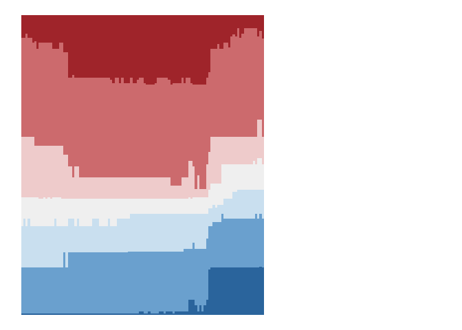
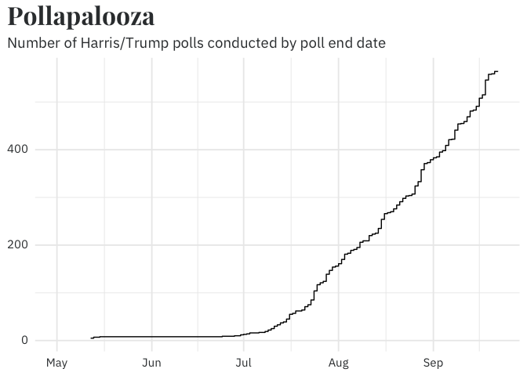
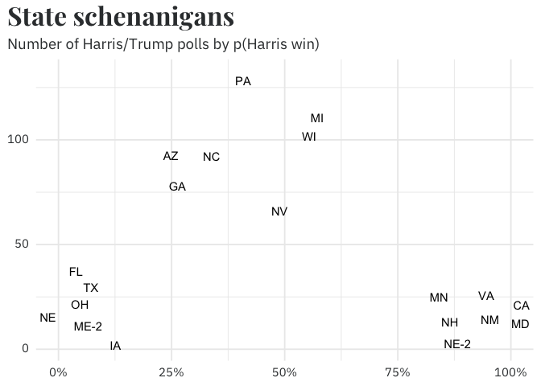
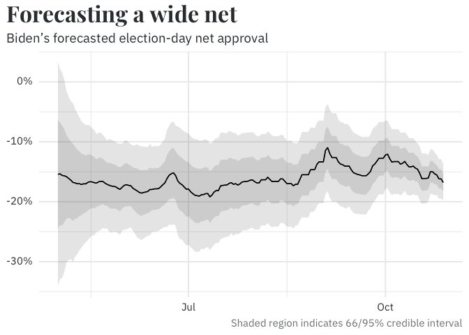
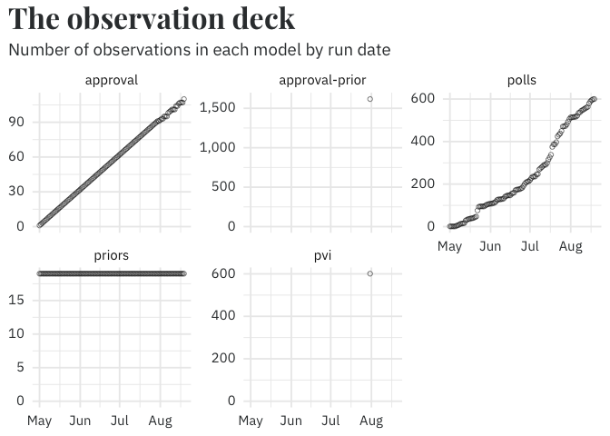
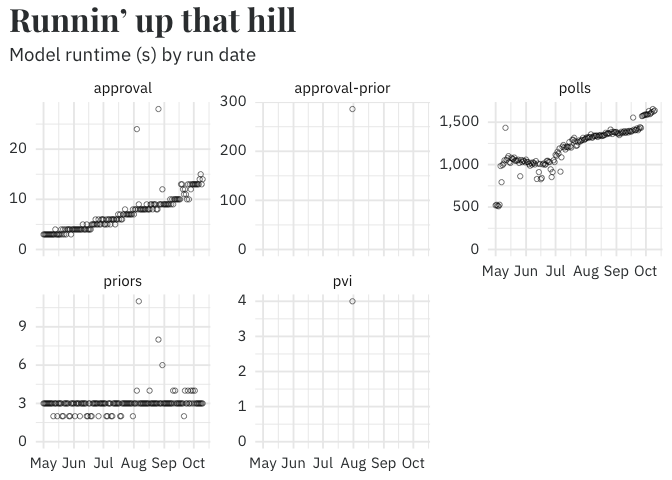
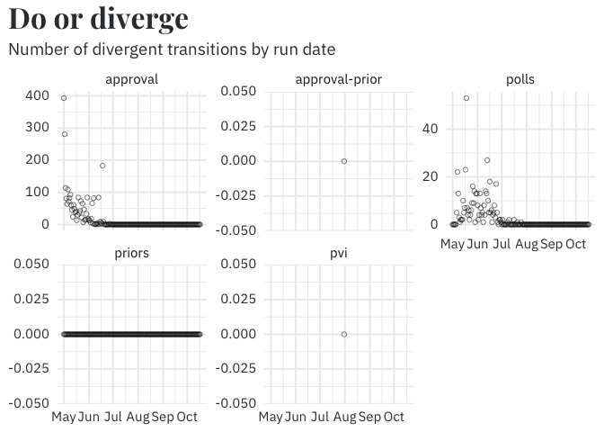
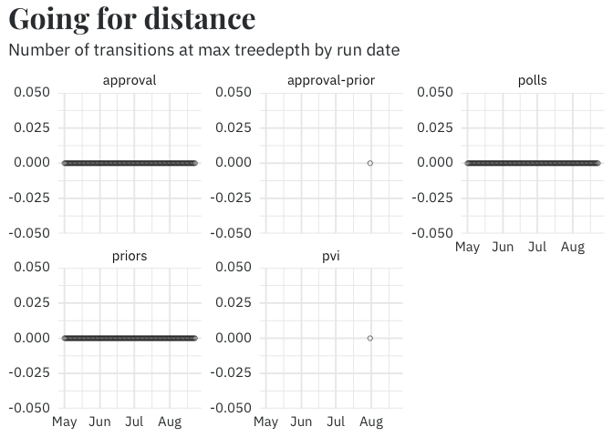

# Output Review

This document contains a host of information/metadata about the model
runtime and sampler conditions that is useful but not appropriate for
displaying on-site. There are three broad categories of information
displayed:

**Weekly updates**

- Top-level change in the probability of winning in the past week
- State-level ratings changes

**Data**

- Number of polls conducted by rundate
- Number of state-level polls by probability of a democratic win
- Biden’s forecasted approval by rundate

**Diagnostics**

- Observations by rundate
- Model runtime by rundate
- Number of divergent transitions by rundate
- Number of transitions at max treedepth by rundate

I also include here a plot of the change in state ratings over time
because I think it looks nifty.

## Weekly updates

Weekly change in probability of winning the presidency:

- Harris: **48%** → **52%**
- Trump: **52%** → **48%**

Weekly change in state ratings:

| state        | last_week       | today           |
|:-------------|:----------------|:----------------|
| Idaho        | Safe Rep        | Very likely Rep |
| Indiana      | Very likely Rep | Safe Rep        |
| Iowa         | Very likely Rep | Likely Rep      |
| Maine CD-2   | Uncertain       | Likely Rep      |
| New Mexico   | Likely Dem      | Very likely Dem |
| North Dakota | Safe Rep        | Very likely Rep |
| Rhode Island | Very likely Dem | Safe Dem        |
| Virginia     | Likely Dem      | Very likely Dem |
| Washington   | Very likely Dem | Safe Dem        |

## Data

## Diagnostics

